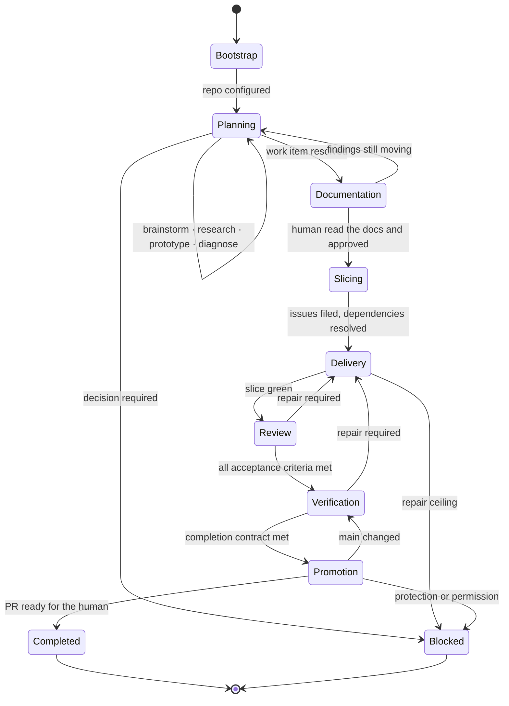

# Conversation-to-main workflow

This is the canonical delivery state machine for this repository. It applies equally to **Codex,
Claude, and human contributors**—the vendor adapters (`.claude/`, `.codex/`) implement it; they
never redefine it.

Work **matures**: a diffuse item advances by one concrete next step at a time and never skips a
step it hasn't earned.

## Default lifecycle

## 0 · Bootstrap—once per repository

`.sdlc/sdlc-config.yml` ships with `<ANGLE BRACKET>` placeholders. Until they are filled, every
other step stops and returns here. Bootstrap interviews the human on stack and modules, writes the
config and coding standards, **verifies each quality gate by running it**, wires CI, creates the
labels and optional project board, and seeds `wiki/` and `specs/`.

A gate that doesn't run is worse than no gate, because the reviewer reports it green.

## 1 · Start from conversation

When the human asks to plan something:

1. Inspect current `main`, the product context, the code, the tests, the decision records, and
   the open work.
2. Open or resume a plan folder under `wiki/plans/<NN>-<slug>/`.
3. Interview **one material decision at a time**. Recommend an answer and state the trade-off.
4. Persist agreed vocabulary into `wiki/CONTEXT.md` as it is pinned, and the resolved work items
   into the plan map.
5. Use the **spec analyst** to find gaps before presenting anything as finished.

The agent owns all repository mechanics. Never ask the human to create internal files or repeat
the same intent in a second prompt.

## 2 · Mature each work item

A work item carries exactly **one next step**, chosen by what the item actually *lacks*:

| Next step | For |
|---|---|
| brainstorm | its shape, scope, or goal isn't settled |
| research | an external fact decides it—cite primary sources |
| prototype | it can't be settled on paper; throwaway code in its own worktree |
| diagnose | something is wrong and the mechanism is unknown; prove it, don't fix it |
| decide | two named options, both understood, nothing left to learn |
| write-document | resolved enough to become durable docs |
| create-issues | the docs are reviewed and confirmed |
| implement | already sliced into an issue |

After each step returns, **re-read every other work item** and update the ones it touched. This is
what keeps a plan coherent instead of a set of parallel monologues.

A brainstorm that should have been research burns a session on opinion where a fact was available.

## 3 · Document, then stop

Resolved findings become durable documentation: PRDs in `wiki/prd/`, system shape in
`wiki/architecture/`, exact **as-built** contracts in `specs/`, and dated decision records.
FDRs record business calls; ADRs record technology and structure. Superseded, never deleted.

**Then stop for the human to read them.** Issues are outward state; they are not created from
unreviewed docs. `write-document` and `create-issues` are two separate steps, always.

## 4 · Slice vertically

The **slice planner** converts reviewed documentation into the smallest dependency-aware outcomes
a user or operator can observe.

Every slice records acceptance criteria, dependencies, likely file surface, first failing test,
focused and repository-wide gates, and whether parallel work is safe.

A slice spans Domain → Infrastructure → Service → API/UI for **one narrow behavior within a single
module**, at or under `implement.max_changed_loc` including tests. Larger work is split with a
named strategy and linked by `Depends On`. Reject horizontal layers.

One issue is one branch and one PR—or, in batch mode, one ordered set of issues sharing one
branch and one PR. Never one PR per slice within an issue.

## 5 · Deliver with TDD

For each dependency-ready issue:

1. **Feasibility gate**—audit the issue against the current codebase before any worktree exists.
2. Create the worktree from `implement.worktree_path` / `implement.branch`.
3. Exactly **one slice implementer** owns the write surface.
4. **RED**: add a test and prove it fails for the intended reason.
5. **GREEN**: implement the smallest passing behavior.
6. **REFACTOR**: improve structure while relevant tests stay green.
7. Run the focused gates for every module touched.
8. Assign a **separate read-only reviewer**. Maximum three rounds, then escalate.
9. Repair blocking findings and repeat review.

The mandatory implementation cycle is **RED → GREEN → REFACTOR**.

Parallelize read-heavy work freely. Parallelize writes only for independent slices with isolated
files or worktrees. **Never allow overlapping writers.**

## 6 · Verify

Before promotion, the **integration verifier** runs the completion contract:

- map every acceptance criterion to passing evidence;
- run the full `quality_gates` block for every module touched;
- run the template contract—`make check`;
- confirm any spec whose described behaviour changed was updated **in the same change**;
- verify migrations, rollback, observability, accessibility, cost, and documentation where
  applicable;
- record the exact commands and results.

**Agent confidence is not evidence.** Skipped, weakened, or deleted tests cannot satisfy a gate.

## 7 · Promote

1. Reconcile current `main`.
2. Re-run affected gates if `main` changed.
3. Check off the issue's Implementation Tasks—closing an issue from a PR does not tick plain
   checklist lines.
4. Push the final state and open the PR with `Closes #<NNN>`.
5. Wait for required remote checks and reviews.
6. Drive **every** review comment to resolved: each ends fixed-and-replied or
   declined-and-replied, and its thread marked resolved.
7. **The human merges.** Confirm the resulting `main` commit, then reconcile: update each affected
   spec's Current State, close the issue, remove the worktree, and unblock dependents.

Never force-push, bypass protection, merge a failing PR, or **merge on the human's behalf**.
Deployment is a separate lifecycle unless explicitly included and authorized.

## Repair and stop rules

Recoverable failures loop through implementation and review. After **three failed repairs for the
same root cause**, set state `blocked` and report:

- failing command or criterion;
- observed evidence;
- attempted repairs;
- current hypothesis;
- the smallest human decision or external action required.

Stop earlier for unresolved product behavior, authorization, credentials, compliance, destructive
migration, unavailable permission, or conflicting sources. **Never silently reduce scope.**

## Roles

Canonical, vendor-neutral definitions live under `.agents/roles/`; `.claude/agents/` and
`.codex/agents/` are thin adapters onto them.

| Role | Owns | Runs during |
|---|---|---|
| `spec-analyst` | gap audit before docs are written | step 1, step 5's feasibility gate |
| `slice-planner` | reviewed docs → vertical slices | step 4 |
| `slice-implementer` | the only writer for one slice | step 5 |
| `reviewer` | read-only review of one slice | step 5 |
| `diff-reviewer` | two-axis Standards + Spec review of a diff | step 7 |
| `integration-verifier` | acceptance → evidence completion contract | step 6 |

There is deliberately **no separate test-architect**: the slice implementer owns its own first
failing test, because whoever writes the behavior is who knows what RED should look like.
Implementers never approve their own work.
