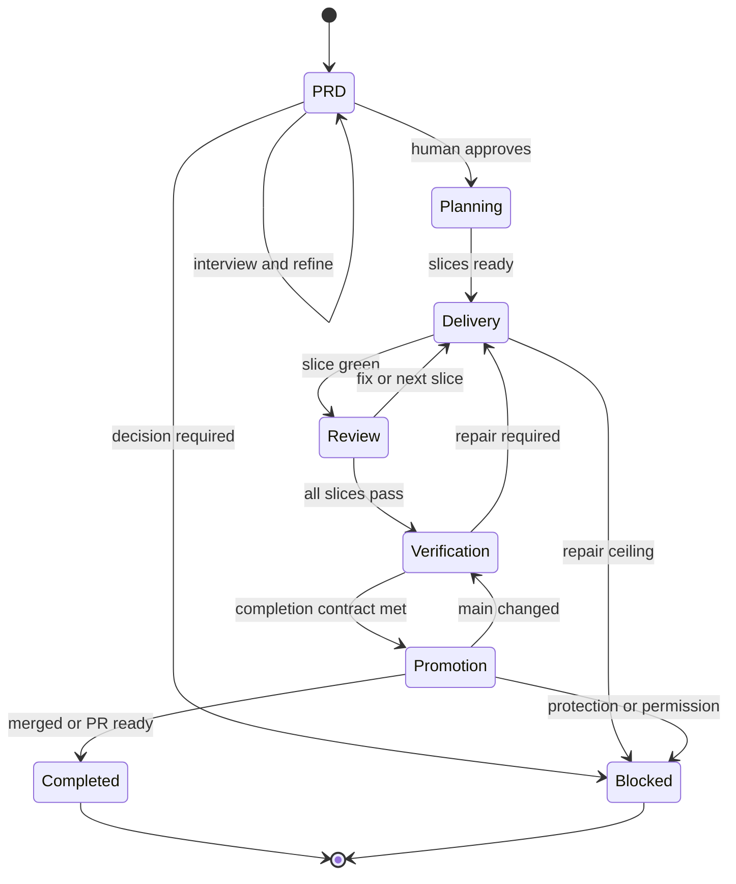

# Conversation-to-main workflow

This is the canonical feature-delivery state machine for this repository. It applies equally to Codex, Claude, and human contributors.

## Default lifecycle

## 1. Start from conversation

When the human asks to plan a feature or PRD:

1. Inspect current `main`, product context, code, tests, ADRs, and open work.
2. Choose a stable lowercase spec ID.
3. Create `feature/<spec-id>` from current `main`.
4. Create `specs/<spec-id>/` from the internal template.
5. Interview one material decision at a time. Recommend an answer and state the trade-off.
6. Persist agreed vocabulary, requirements, non-goals, risks, and acceptance criteria as the conversation proceeds.
7. Use the spec analyst to find gaps before presenting the completed PRD.

The agent owns all repository mechanics. Never ask the human to invoke a workflow command, create internal files, or repeat the PRD in another prompt.

## 2. Lock the PRD

The PRD is locked only after explicit PRD approval from the human, such as “approved”, “lock it”, “go ahead”, or an unambiguous equivalent.

Unless the human said **plan only**, approval grants authority to:

- commit the PRD on its feature branch;
- create/update the pull request;
- implement all approved slices;
- run tests and specialist reviews;
- repair failures;
- merge the green PR to `main` when repository policy permits.

Approval does not authorize deployment, production credentials, destructive external actions, bypassing protections, or material scope changes.

If the human says **PR only**, use `pr_ready_only`. If they say **plan only**, stop after the PRD with `plan_only`.

## 3. Slice vertically

The slice planner converts the locked PRD into the smallest dependency-aware outcomes a user or operator can observe.

Every slice records:

- acceptance criteria;
- dependencies;
- likely file surface;
- first failing test;
- focused and repository-wide gates;
- security/AI evaluation classification;
- whether parallel work is safe.

One feature uses one branch and one PR. Each completed slice normally becomes one coherent commit. Do not create one PR per slice.

## 4. Deliver with TDD

For each dependency-ready slice:

1. A test architect defines the public behavior and first RED test.
2. Exactly one slice implementer owns the write surface.
3. RED: add a test and prove it fails for the intended reason.
4. GREEN: implement the smallest passing behavior.
5. REFACTOR: improve structure while relevant tests remain green.
6. Run focused gates.
7. Commit the slice.
8. Assign a separate read-only reviewer.
9. Repair blocking findings and repeat review.

The mandatory implementation cycle is RED → GREEN → REFACTOR.

Parallelize read-heavy work freely. Parallelize writes only for independent slices with isolated files or worktrees. Never allow overlapping writers.

## 5. Verify

After all slices pass:

- map every acceptance criterion to passing evidence;
- run the full test, type, lint, build, security, and E2E gates configured in `AGENTS.md`;
- run specialist security review for trust-boundary changes;
- run AI-evaluation review for model, prompt, tool, schema, routing, or threshold changes;
- verify migrations, rollback, observability, accessibility, cost, and documentation where applicable;
- record exact commands and results in `verification.md`.

Agent confidence is not evidence. Skipped, weakened, or deleted tests cannot satisfy a gate.

## 6. Promote

1. Reconcile current `main`.
2. Re-run affected gates if `main` changed.
3. Push final state and mark the PR ready.
4. Wait for required remote checks and reviews.
5. For `merge_when_green`, merge through the repository’s protected method.
6. For `pr_ready_only`, leave the PR ready for the required human action.
7. Confirm the resulting PR and `main` commit, mark state complete, report, and stop.

Never force-push, bypass protection, or merge a failing PR. Deployment is a separate lifecycle unless explicitly included and authorized.

## Repair and stop rules

Recoverable failures loop through implementation and review. After three failed repairs for the same root cause, set state `blocked` and report:

- failing command or criterion;
- observed evidence;
- attempted repairs;
- current hypothesis;
- smallest human decision or external action required.

Stop earlier for unresolved product behavior, authorization, credentials, compliance, destructive migration, unavailable permission, or conflicting sources. Never silently reduce scope.
